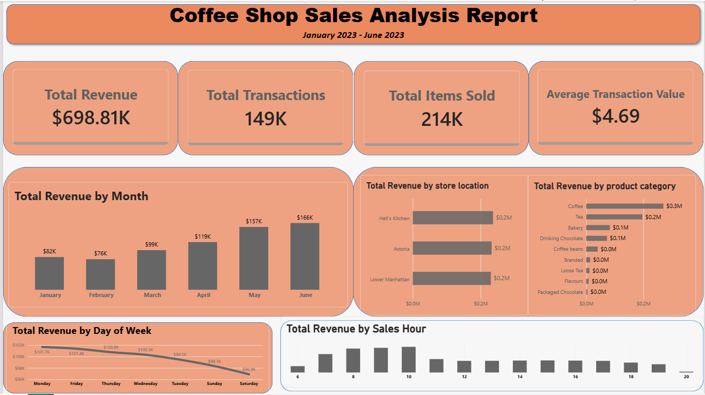

# Coffee Shop Sales Analysis

## Project Overview

This is my first end-to-end data analysis project, where I analyzed coffee shop transaction data to understand sales performance and identify useful business insights.

I worked with raw transaction data and used SQL for data analysis and Power BI to build an interactive dashboard.

## Tools Used

- Excel — Initial data inspection and cleaning
- SQL Server — Data analysis and business queries
- Power BI — Data visualization and dashboard

## Business Questions

The analysis focuses on questions such as:

- What is the overall sales performance?
- How does revenue change over time?
- Which store locations generate the most revenue?
- Which product categories contribute the most revenue?
- Which products generate the most revenue?
- What hours of the day have the highest sales activity?
- How does sales performance vary across days of the week?

## Key Metrics

- Total Revenue: $698,812.33
- Total Transactions: 149,116
- Total Items Sold: 214,470
- Average Transaction Value: $4.68

## Project Files

- `Coffee Shop Sales raw data.csv` — Raw transaction dataset
- `Coffeeshopale_analysis.sql` — SQL queries used for analysis
- `Coffeeshopsales_dashboard.pbix` — Power BI dashboard

## Data Source

The dataset was obtained from Kaggle.

## Dashboard

The Power BI dashboard summarizes revenue performance across different time periods, store locations, product categories, and sales hours.

More details and findings will be added as part of the project documentation.

## Dashboard

